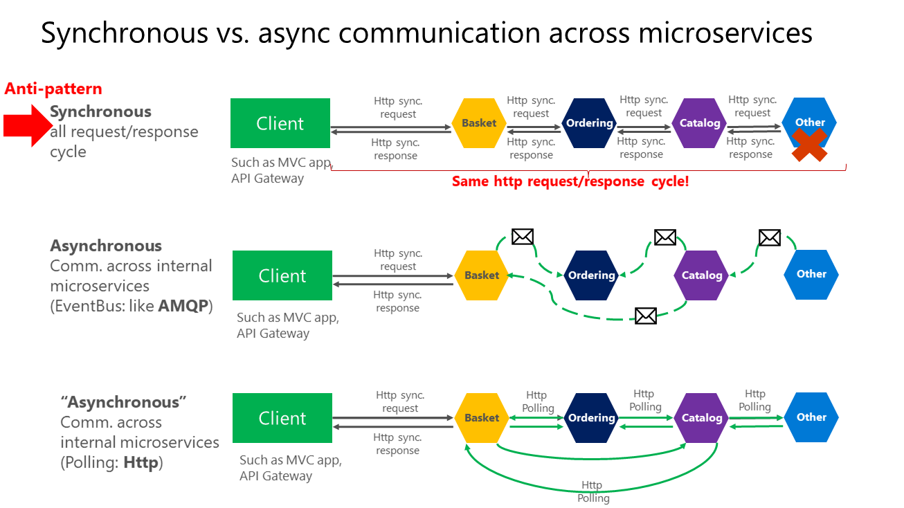

# Lyo - CRUD:

Spring Boot 
O Spring WebFlux utiliza internamente o Project Reactor e seus implementadores de editor: Flux e Mono.
O novo marco admite os modelos de programa: Componentes reativos baseados em anotações
Registro e manutenção do MongoDB funcional.
